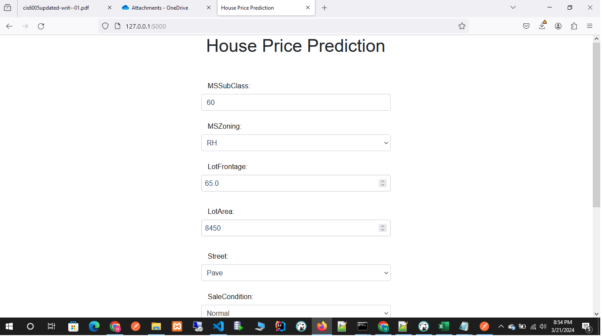
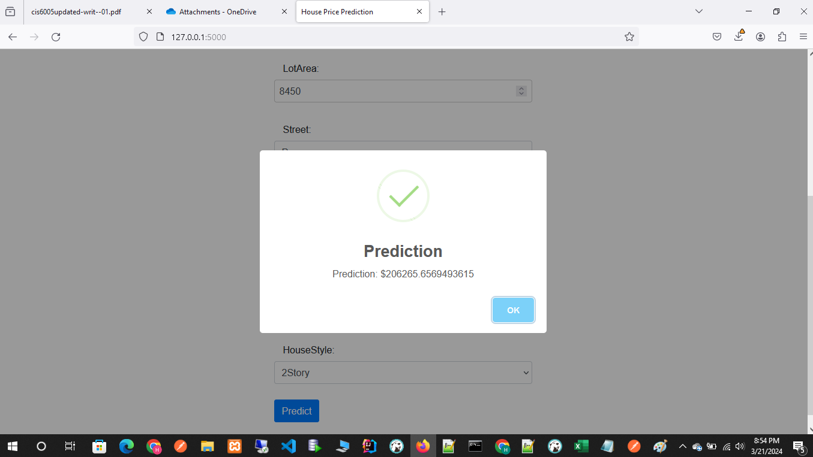

# House Price Prediction - 2024 ( Project run with frontend )
- open terminal & run `python app.py`
- Open web browser and http://127.0.0.1:5000/ you can see frontend

## Submit Form

## Result

# House Price Prediction - 2024 (Kaggle Compitition)

This project involves predicting house prices using machine learning techniques. The provided code includes data preprocessing, model training, evaluation, and prediction steps.

## Prerequisites

- Python 3.x
- Jupyter Notebook (optional)
- Required Python libraries: pandas, numpy, scikit-learn, matplotlib, seaborn

## Usage

### Running the Python Script

1. Navigate to the project directory containing the Python script (`src/main.py`).
2. Run the script using the command `python src/main.py`.
3. Follow the instructions provided in the script to load the model, make predictions, and save the results.

## File Descriptions

- `House_Price_Prediction_2024.ipynb`: Jupyter Notebook containing the code for data analysis, preprocessing, modeling, and evaluation.
- `src/main.py`: Python script for model inference and prediction.
- `house_price_prediction_model.pkl`: Serialized model file containing the trained machine learning model.
- `submission.csv`: CSV file containing the predicted house prices for the test dataset.

## Acknowledgments

- This project was created as part of a machine learning course.
- Thanks to Kaggle for providing the dataset used in this project.
